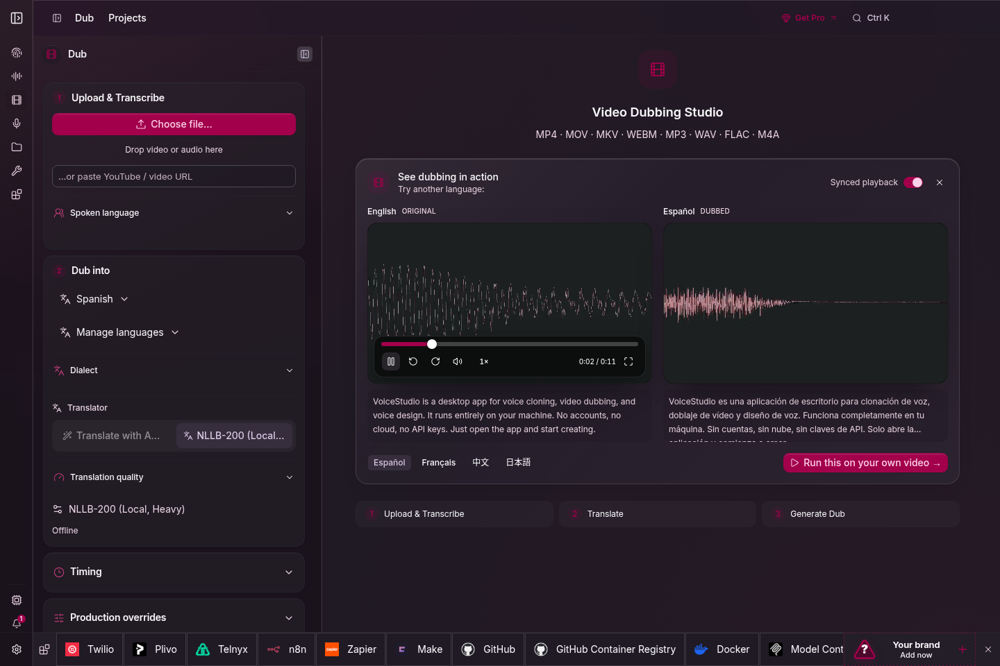
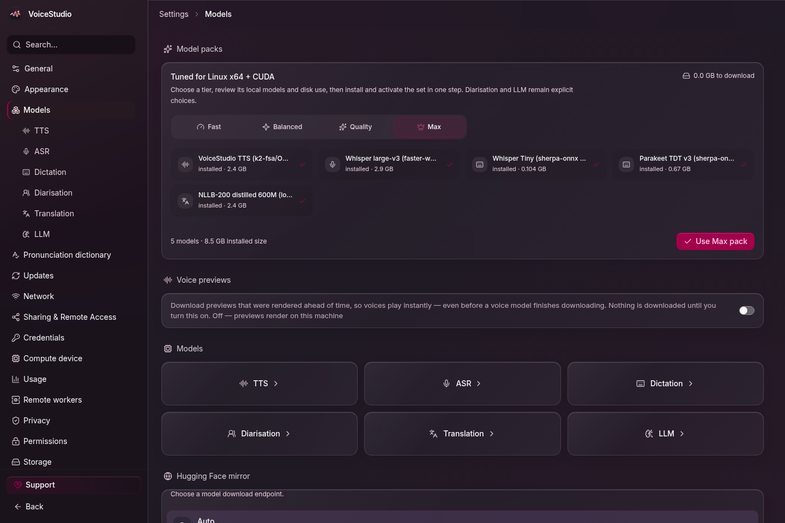

<div align="center">
  
  <h1>VoiceStudio</h1>
  <p>
    <a href="https://trendshift.io/repositories/28176?utm_source=repository-badge&amp;utm_medium=badge&amp;utm_campaign=badge-repository-28176" target="_blank" rel="noopener noreferrer"></a>
  </p>
  <p><strong>Open source voice cloning and workflow engine. Build local.</strong></p>
  <p>
    <a href="https://voicestudio.sh/?utm_source=github&utm_medium=readme&utm_campaign=project">Website</a> ·
    <a href="https://github.com/debpalash/VoiceStudio/releases/latest">Download</a> ·
    <a href="#get-started">Get started</a> ·
    <a href="#documentation">Docs</a> ·
    <a href="https://discord.gg/bzQavDfVV9">Discord</a> ·
    <a href="README_CN.md">简体中文</a>
  </p>
  <p>
    <a href="https://github.com/debpalash/VoiceStudio/actions/workflows/ci.yml"></a>
    <a href="https://github.com/debpalash/VoiceStudio/releases/latest"></a>
    <a href="LICENSE"></a>
  </p>
</div>


## Your voice. Your workflow.

| Create | Produce | Connect |
| :--- | :--- | :--- |
| Clone a voice or design your own | Dub videos with timed speech | Local API & MCP for agents |
| Dictate with a floating widget | Stories, audiobooks & batch jobs | Optional remote workers |

Start with **VoiceStudio** (default, powered by k2-fsa/OmniVoice), or choose another engine. [Features & engine catalog](docs/feature-catalog.md).

Local workflows run on your hardware. Remote services are optional; usage analytics requires consent.

<details>
<summary><strong>Explore the workspaces</strong> · Clone, dub, design & models</summary>

<table>
  <tr>
    <td></td>
    <td></td>
  </tr>
  <tr><td align="center">Voice cloning</td><td align="center">Video dubbing</td></tr>
  <tr>
    <td></td>
    <td></td>
  </tr>
  <tr><td align="center">Voice design</td><td align="center">Local models</td></tr>
</table>


</details>

## Get started

Download from [Releases](https://github.com/debpalash/VoiceStudio/releases/latest), then follow your platform guide:

**[macOS](docs/install/macos.md) · [Windows](docs/install/windows.md) · [Linux](docs/install/linux.md) · [Docker](docs/install/docker.md)**

Open **Voice cloning**, choose a voice or add a clean reference recording, enter your text, and generate. Install the required model when prompted. Hardware needs vary by engine; see [performance](docs/performance.md).

### Let your agent set it up

Copy this prompt into your coding agent to install VoiceStudio and configure it for your device:

```text
Install and configure VoiceStudio on this device, then verify it works.
Repository: https://github.com/debpalash/VoiceStudio

Read the repository's install guide for my OS, docs/performance.md, and
skills/voicestudio/SKILL.md. Install the voicestudio audio-workflow skill
with `npx skills add debpalash/VoiceStudio` if your agent supports skills;
otherwise follow that SKILL.md directly.

Detect my OS, CPU architecture, GPU, available RAM/VRAM, free disk space,
and any existing VoiceStudio installation, backend, or downloaded models.
Reuse existing data and models. Prefer the latest stable Electron installer
for my OS and architecture; use the documented source setup if needed.
If migrating from Tauri, follow docs/electron-migration.md and back up first.

Configure local voice cloning using a supported engine and acceleration
that fit this device. Keep working defaults and verify the actual execution
device rather than assuming GPU support. Install required dependencies;
reuse a suitable installed model, or explain the download size and license
and ask before downloading one. Keep cloud services and analytics opt-in.

Start the app, check /health at the configured backend address (default
http://localhost:3900), and discover its API through /openapi.json. Generate
a short test with a bundled or authorized voice and verify the audio file.
Report the installed version, engine, actual device, data location, audio
output path, and how to reopen the app. Complete the setup, not just a plan;
identify any permissions or manual steps you cannot perform.
```

<details>
<summary><strong>Run the Electron preview from source</strong></summary>

```bash
git clone https://github.com/debpalash/VoiceStudio.git
cd VoiceStudio
bun install
bun run dev
```

See [Electron setup](electron/README.md) for prerequisites and backend configuration.

</details>

> **Electron is the primary desktop app.** Version 0.5.3 introduced Electron and was the final Tauri release. Existing Tauri users must [install Electron separately](docs/electron-migration.md). Bug reports and contributions remain welcome; include the app version and whether you use Electron or Tauri.

## Documentation

| Need | Start here |
|---|---|
| Setup help | [Troubleshooting](docs/install/troubleshooting.md) · [Model downloads](docs/downloading-models.md) |
| Models & audio quality | [Engine guides](docs/engines/README.md) · [Benchmarks](docs/benchmarks.md) |
| Integrations | [Local API](docs/speech-platform.md) · [MCP](docs/mcp.md) · [Examples](examples/README.md) |
| Development | [Contributing](.github/CONTRIBUTING.md) · [Electron](electron/README.md) · [Changelog](CHANGELOG.md) |

Agent skills: `npx skills add debpalash/VoiceStudio` — choose **voicestudio** for audio workflows or **voicestudio-maintainer** for repository maintenance.

## Sponsors

<a href="https://forms.gle/2PYCvd39hbwijzX37"></a>

**Become a featured partner.** [Apply for a paid placement](https://forms.gle/2PYCvd39hbwijzX37) · [Email us](mailto:partner@voicestudio.sh)

Support development: [Ko-fi](https://ko-fi.com/debpalash) · [PayPal](https://paypal.me/palashCoder) · [Sponsorship details](SPONSORS.md)

## License & responsible use

[AGPL-3.0](LICENSE). Models have their own licenses; review them before commercial use. Clone voices only with permission. See [license details](LICENSE-NOTICE.md).
